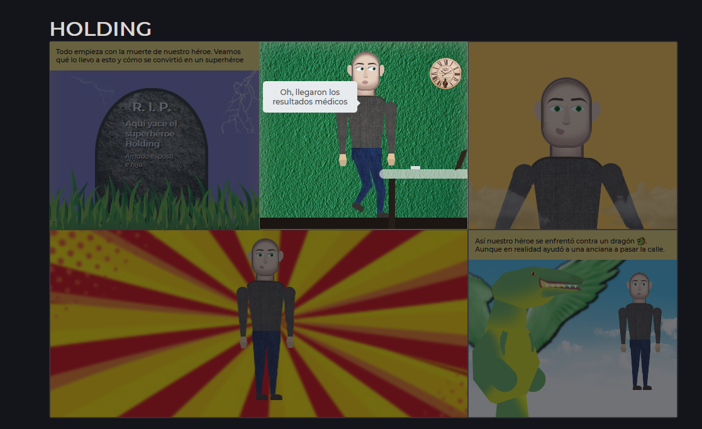

# HOLDING

Este es un comic contruido con HTML, CSS y JS el cual cuenta la história de un héroe poco convencional llamado HOLDING(Claro, ese es su alias su verdadero nombre es TOM).

## Sobre el proyecto

El proyecto usa tecnologías nativas, no usa librerías ni demás cosas. Se usan los fetch como imports de otros archivos HTML y en general el js principalmente se usa para pasar entre escenas del comic cuando acabe una animación crucial de la escena, como se puede ver en la siguiente imágen:

Por cierto, los personajes son construidos principalmente con CSS, lo único que no es así serían texturas como ropa, faldas, alas, etc...

## CÓMO VER EL PROYECTO

la url del proyecto funcionando es esta: [a link](https://dereksamuel.github.io/HOLDING/)
